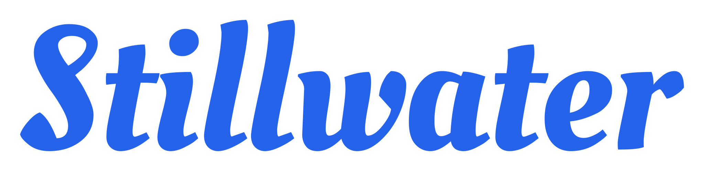

<p align="center">
  
</p>

[](https://github.com/sydlexius/stillwater/actions/workflows/ci.yml)
[](https://github.com/sydlexius/stillwater/actions/workflows/release.yml)
[](https://codecov.io/gh/sydlexius/stillwater)
[](https://securityscorecards.dev/viewer/?uri=github.com/sydlexius/stillwater)
[](LICENSE)
[](go.mod)

Stillwater is a self-hosted web app that curates the artist and composer
metadata for your music library and gets it where it needs to go: into the
`artist.nfo` files your servers read, pushed to Emby or Jellyfin over their
APIs, or both. It pulls from ten metadata providers with per-field fallback, so
the indie, regional, classical, and non-Latin-script artists that leave other
tools blank usually resolve here, and per-library locking keeps your manual
edits from being clobbered the next time a server refreshes.

<p align="center">
  <video src="https://github.com/user-attachments/assets/cd51e696-f639-44c4-960d-9cce0c0659a9" poster="docs/hero/hero-static.png" width="800" controls></video>
</p>

**Full documentation:** <https://sydlexius.github.io/stillwater/>

## Features

- **Ten metadata providers, per-field fallback.** MusicBrainz, Fanart.tv,
  Discogs, TheAudioDB, Spotify, Last.fm, Deezer, Genius, Wikidata, and Wikipedia,
  ranked per field so when one source comes up empty another fills the gap, plus
  opt-in DuckDuckGo web image search for the stragglers.
- **Deliver by NFO writeback, direct API push, or both.** Write `artist.nfo`
  files that Emby, Jellyfin, and Kodi all read cleanly, and/or push edits
  straight to Emby and Jellyfin over their APIs. Stillwater only ever touches
  metadata and artwork, never your audio files.
- **Per-library edit locking.** Your manual corrections stay put instead of
  drifting back every time a media server rewrites the file on refresh.
- **Rule-driven cleanup with a conflict gate.** A rule engine flags missing,
  inconsistent, or low-quality metadata and artwork and fixes it in bulk or one
  at a time, with a round-trip conflict check guarding every write-back.
- **Artwork pipeline.** Fetch, compare, and crop thumbnails, fanart, logos, and
  banners across providers from a single comparison view.
- **Reports and a live dashboard.** Library-health scoring, a prioritized action
  queue, duplicate detection, the Unmatched Files report, and a live activity feed.
- **Runs on your hardware.** Single binary or container, SQLite, no cloud, no
  telemetry, no account, with a REST API at `/api/v1/` and webhooks for
  automation.

## Quick start

```yaml
# docker-compose.yml
services:
  stillwater:
    image: ghcr.io/sydlexius/stillwater:latest
    container_name: stillwater
    ports:
      - "1973:1973"
    environment:
      - PUID=99
      - PGID=100
      - GOMAXPROCS=2  # keep equal to `cpus` below
    volumes:
      - stillwater-data:/config
      - /path/to/your/music:/music:rw
    restart: unless-stopped
    cpus: "2.0"
    pids_limit: 512
    ulimits:
      nofile:
        soft: 8192
        hard: 8192

volumes:
  stillwater-data:
```

```bash
docker compose up -d
```

Then open <http://localhost:1973>.

Looking for a different install path, configuration knobs, or details on
how Stillwater plays with media-server NFO write-back? It's all on the
**[project site](https://sydlexius.github.io/stillwater/)**: install
guides (Docker, binary, Unraid Community Applications, reverse proxy),
environment-variable reference, encryption-key handling, the
round-trip-conflict gate, and the full OpenAPI reference.

Binary downloads live on the
[Releases](https://github.com/sydlexius/stillwater/releases) page.
Nightly builds (`nightly-YYYYMMDD`) ship from `main` each day there are
new commits. See the
[self-update guide](https://sydlexius.github.io/stillwater/how-to/self-update/)
for the nightly channel.

Release binaries are code-signed; see the
[Code Signing Policy](https://sydlexius.github.io/stillwater/legal/code-signing-policy/)
for the signing process and role listing. For a description of what network
connections Stillwater makes, see the
[Privacy Policy](https://sydlexius.github.io/stillwater/legal/privacy-policy/).

## Contributing

Contributions are welcome. See [CONTRIBUTING.md](CONTRIBUTING.md) for the
dev environment setup, code style, and pull-request workflow. Participants
are expected to follow the project
[Code of Conduct](CODE_OF_CONDUCT.md).

## License

[GPL-3.0](LICENSE)
