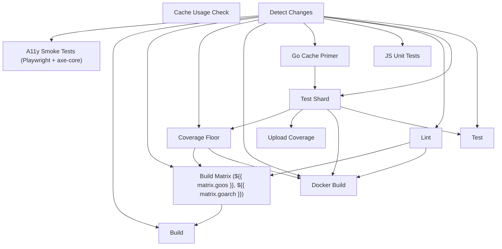

<!-- Generated by gen-ci-reference. DO NOT EDIT. Run 'make generate-docs' to regenerate. -->

# CI Reference

This page documents the structure of the Stillwater CI pipeline. It is generated automatically from `.github/workflows/ci.yml` by `cmd/gen-ci-reference` and reflects the current job dependency graph and test matrix configuration.

## Job Dependency Graph

## Test Matrix Shards

| Shard | Packages / Notes | Partition |
|---|---|---|
| `api-1` | `internal/api` | Partitioned shard 1 of 2: test functions split by round-robin over sorted names |
| `api-2` | `internal/api` | Partitioned shard 2 of 2: test functions split by round-robin over sorted names |
| `rule-1` | `internal/rule` | Partitioned shard 1 of 2: test functions split by round-robin over sorted names |
| `rule-2` | `internal/rule` | Partitioned shard 2 of 2: test functions split by round-robin over sorted names |
| `services` | `internal/auth internal/image internal/artist` | Named shard: all tests in listed packages |
| `settingsio` | `internal/settingsio` | Named shard: all tests in listed packages |
| `providers` | `internal/provider internal/connection` | Named shard: all tests in listed packages |
| `scan` | `internal/scanner internal/library internal/database internal/scraper internal/foreign internal/watcher` | Named shard: all tests in listed packages |
| `rest` | `_dynamic_` | Remainder: all packages not covered by a named shard, derived at runtime to auto-include new packages |

## Test Aggregator Pattern

The `test-summary` job owns the **"Test"** check name that branch protection
requires. It runs under `always()` so a check result is always posted even
when individual shards fail or are canceled.

This pattern decouples the matrix shard count from branch protection rules:
shards can be added, removed, or renamed without updating the required-checks
list. Branch protection requires one check ("Test") and `test-summary`
always reports it -- passing only when every shard in the matrix succeeds.
