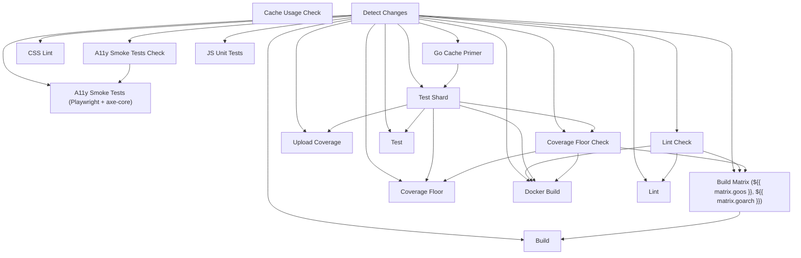

<!-- Generated by gen-ci-reference. DO NOT EDIT. Run 'make generate-docs' to regenerate. -->

# CI Reference

This page documents the structure of the Stillwater CI pipeline. It is generated automatically from `.github/workflows/ci.yml` by `cmd/gen-ci-reference` and reflects the current job dependency graph and test matrix configuration.

## Job Dependency Graph

## Test Matrix Shards

Test shards are computed dynamically at runtime (see the `test_matrix` output in ci.yml).

## Test Aggregator Pattern

The `test-summary` job owns the **"Test"** check name that branch protection
requires. It runs under `always()` so a check result is always posted even
when individual shards fail or are canceled.

This pattern decouples the matrix shard count from branch protection rules:
shards can be added, removed, or renamed without updating the required-checks
list. Branch protection requires one check ("Test") and `test-summary`
always reports it -- passing only when every shard in the matrix succeeds.
