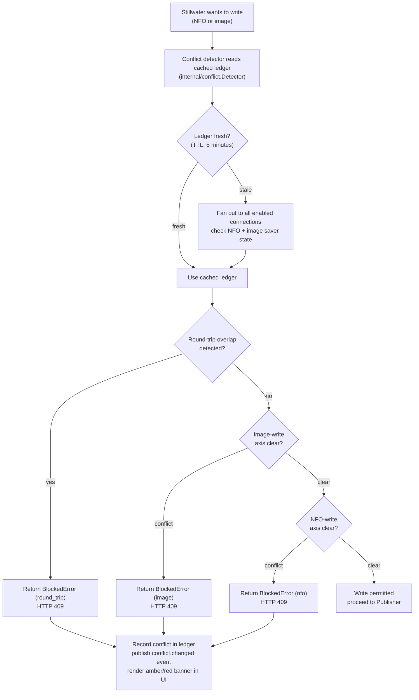

# Conflict gate

When Stillwater writes NFO files or images into a shared music library
directory, a connected Emby, Jellyfin, or Lidarr peer may be configured to
write its own copies of those files back to disk (for Lidarr, via its
`/api/v1/metadata` consumers). The two processes then overwrite each other in a
loop. The conflict gate prevents Stillwater from writing until the conflict is
resolved.

## Incoming metadata to coalesce-or-apply

## Conflict states

The ledger distinguishes three axes of conflict:

| Axis | Trigger | Banner state |
|---|---|---|
| `image` | A connected server has "image saving" on | Amber (state A) |
| `nfo` | A connected server has "NFO saving" on | Amber (state B) |
| `round_trip` | Two connections share the same library path on disk | Red (state C) |

These states are not mutually exclusive. When both image and NFO savers are
active on the same connection the banner shows a composite amber state. A
round-trip overlap takes highest precedence and shows red regardless of which
individual savers are on.

Lidarr participates in the `image` and `nfo` axes (the detector queries its
metadata consumers and can disable them via `DisableFileWriteBack`), but it is
excluded from `round_trip` detection: Lidarr exposes no per-library-path surface
the way Emby and Jellyfin VirtualFolders do, so its write-back is governed by a
single global setting rather than a per-path overlap check
(`detector.go` returns an empty path slice for a Lidarr connection).

A fifth state, `foreign_files`, is surfaced by the banner when
`internal/foreign` detects image files in the library that have no Stillwater
provenance but there is no active write-back conflict. This is a warning, not
a gate: writes are not blocked, but the user is informed that another process
is managing some images.

## Ledger caching and TTL

The `Detector` caches the ledger for 5 minutes (`defaultTTL` in
`internal/conflict/detector.go`). Callers that need an immediately fresh check
(for example, after the user toggles "Let Stillwater manage") call
`Detector.Invalidate` to force a re-query on the next `Current` call.

Re-queries fan out to all enabled connections concurrently. Each peer call
uses `peerClient.CheckNFOWriterEnabled` and `peerClient.CheckImageSaverEnabled`.
When a check errors out, the detector fails closed: it treats the error as a
conflict so that a temporarily unreachable server never silently unblocks a
write.

Cache stampede protection is implemented via `refreshMu`: the first goroutine
to observe a stale cache holds the refresh lock and does the work; concurrent
waiters re-check the cache after the lock is released and skip the network
fan-out if the first holder already refreshed.

## "Let Stillwater manage"

Each connection has a `ManageServerFiles` toggle. When enabled, Stillwater
calls `peerClient.DisableFileWriteBack` during every ledger refresh. If the
peer's saver was re-enabled by an administrator (for example through the Emby
web UI), the detector turns it off again and updates the ledger so the gate
opens without manual user intervention.

A connection with `ManageServerFiles: true` is excluded from gate checks
regardless of what `CheckNFOWriterEnabled` or `CheckImageSaverEnabled` report,
because Stillwater has already asserted authority over those settings.

## Where to look

| Topic | File |
|---|---|
| `Ledger`, `ConnectionState`, `RoundTrip` types | `internal/conflict/ledger.go` |
| `Gate.AllowImageWrite`, `Gate.AllowNFOWrite` | `internal/conflict/gate.go` |
| `Detector`, TTL logic, peer fan-out | `internal/conflict/detector.go` |
| Coalesce helper | `internal/conflict/detector_coalesce.go` |
| Foreign file scanner | `internal/foreign/` |

The [Core concepts: conflict gate](../../core-concepts/conflict-gate.md) page
covers this topic from a user perspective. This page focuses on the
implementation details relevant to contributors.

See also [Architecture decisions](../architecture-decisions.md) for the ADR
covering the conflict-gate design principles.
