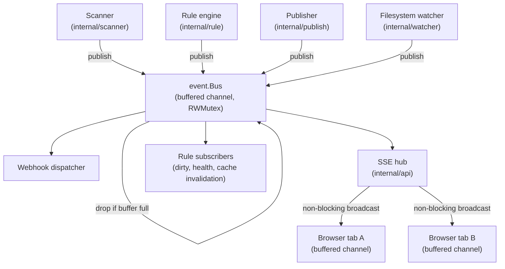

# Event bus and workers

Stillwater coordinates asynchronous activity through a single in-process event
bus (`internal/event.Bus`) that decouples producers from consumers and drives
live browser updates. The bus feeds an SSE hub that fans events out to every
connected browser tab, while a set of context-aware background goroutines handle
recurring work such as backups, database maintenance, and platform lock
synchronization. Every goroutine shares a `context.Context` derived from
`signal.NotifyContext` and exits when that context is canceled; a fixed,
sequenced drain then finishes in-flight work before the process exits.

## Event bus and SSE fan-out

`Bus` wraps a buffered channel guarded by an `RWMutex`-protected subscriber map.
Producers call `Publish`, a non-blocking send: if the buffer is full the event
is dropped and logged (a warning, escalated to an error for
`ConnectionPushFailed` so platform failures survive an overrun pipe). The SSE
hub subscribes to the bus at router construction, converts each internal event
to an SSE message, and broadcasts it non-blockingly to every client channel; a
client whose own small buffer is full is skipped rather than blocking the hub.

## Background worker patterns

Background workers are spawned in `startListeners` (`cmd/stillwater/main.go`) and
follow one of two shapes. Ticker-driven workers create a `time.Ticker` and loop
on `select { case <-ctx.Done(): return; case <-ticker.C: ... }`: the scheduled
database backup, the database maintenance and exists-flag and foreign-file
scanners, the session-cleanup loop, and the platform lock-sync scheduler all use
this pattern, most with a short startup delay so they do not all fire at boot.
Event-driven workers react to external signals: the filesystem watcher uses
`fsnotify` with a poll-interval fallback, and the scanner runs its walk in a
goroutine tracked by a `WaitGroup`. Intervals such as the lock-sync cadence and
the maintenance period are read from database settings with code defaults, so
operators can tune them without a restart.

## Graceful shutdown

`startListeners` derives the shared context from `signal.NotifyContext` for
`SIGINT` and `SIGTERM`. When a signal arrives the context is canceled and every
background goroutine exits on its next `ctx.Done()` branch. After the listeners
return, shutdown runs a fixed sequence rather than relying on a single global
`WaitGroup`: inbound webhook handlers drain (a multi-minute deadline), then
outbound webhook deliveries drain (a short deadline), then the scanner's
`Shutdown` cancels its own context and waits on its `WaitGroup`, then the event
bus stops (its drain loop flushes residual buffered events so nothing queued at
shutdown is lost), and finally the database is closed. The bus `Stop` and
`db.Close` are registered as deferreds early in startup so they fire even on an
early-exit error path.

## Where to look

| Topic | File |
|---|---|
| `Bus`, event type constants, `Publish`, `Subscribe`, `Start`, `Stop` | `internal/event/bus.go` |
| SSE hub, client registration, `Broadcast`, `SubscribeToEventBus` | `internal/api/handlers_sse.go` |
| Bus construction, subscription wiring, worker spawns, shutdown sequence | `cmd/stillwater/main.go` |
| Backup scheduler | `internal/backup/backup.go` |
| Maintenance, exists-flag, and foreign-file schedulers | `internal/maintenance/maintenance.go` |
| Lock-sync scheduler and recent-push grace window | `internal/connection/locksync.go` |
| Filesystem watcher (`fsnotify` + poll fallback) | `internal/watcher/watcher.go` |
| Scanner background goroutine and `Shutdown` | `internal/scanner/scanner.go` |

The scanner's own walk and the events it emits are detailed in
[Scanner pipeline](scanner-pipeline.md).

See also [Architecture decisions](../architecture-decisions.md) for the ADRs on
atomic filesystem writes and singleton rate limiters that the workers described
here interact with.
