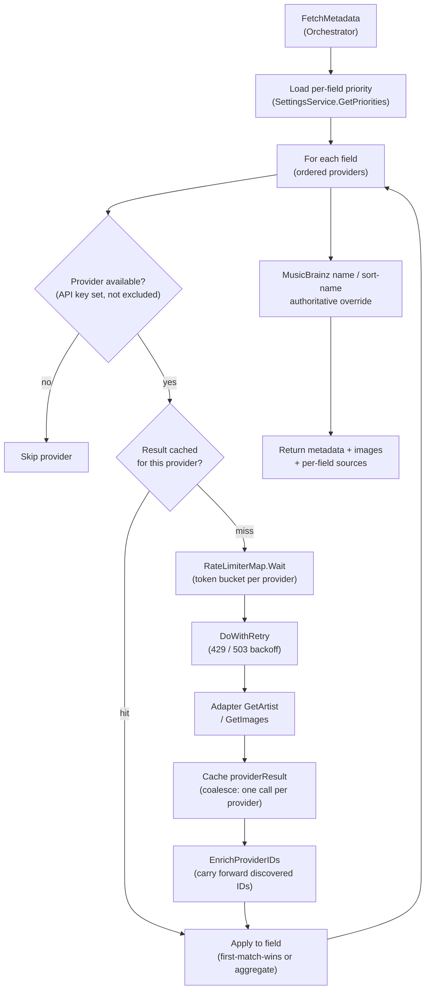

# Providers and coalesce

The provider subsystem (`internal/provider`) populates artist metadata from
external sources such as MusicBrainz, Fanart.tv, and Discogs. The entry point
for a refresh is `internal/provider.Orchestrator.FetchMetadata`. The
orchestrator holds a registry of `Provider` adapters and a settings service
that supplies the per-field priority order. Each adapter enforces its own rate
limit before sending a request, and every HTTP round-trip is wrapped so that
429 and 503 responses are handled before the adapter's own status switch sees
the response.

## Fan-out and coalesce flow

`FetchMetadata` loads the per-field priority list, then walks each field in
order. For each field it iterates the enabled providers, calling
`getProviderResult` per provider. That call checks an in-memory,
mutex-protected per-call cache so each provider is queried at most once per
`FetchMetadata` invocation no matter how many fields list it (the coalesce).
Text fields stop at the first provider that populates the field
(first-match-wins); image fields and tag-slice fields (genres, styles, moods)
continue across all providers and aggregate candidates.

## Adapter contract

The `Provider` interface (`internal/provider/provider.go`) is small: every
adapter implements `Name`, `RequiresAuth`, `SearchArtist`, `GetArtist`, and
`GetImages`. Optional extension interfaces add capabilities without widening
the base contract: `TestableProvider` adds a connection test,
`NameLookupProvider` signals that `GetArtist` can accept an artist name (the
MBID-not-found name-retry path), and `MirrorableProvider` supports self-hosted
mirrors. Adapters signal "no data" with `*ErrNotFound` and transient failure
with `*ErrProviderUnavailable`. The orchestrator treats the two differently: an
`ErrNotFound` is a successful query (stale data may be cleared), while a
transient error leaves the field unqueried so existing data is preserved.

## Priority resolution

Per-field provider priority is stored in the `settings` table and loaded by
`SettingsService.GetPriorities`, which falls back to `DefaultPriorities` for any
field without a stored row. The enabled-provider filter drops any provider in
the per-field disabled set before iteration. A static exclusion map
(`fieldProviderExclusions` in `internal/provider/orchestrator.go`) removes
structurally incapable providers up front; for example MusicBrainz and Wikidata
are excluded from the biography field. MusicBrainz is authoritative for the
artist name and sort name: those are overwritten after the main loop regardless
of iteration order.

## Rate limiting and respectful backoff

`RateLimiterMap` (`internal/provider/ratelimit.go`) holds one
`golang.org/x/time/rate` token-bucket limiter per provider, constructed once at
startup and shared by every adapter and background job. Before every request an
adapter calls `RateLimiterMap.Wait`, which blocks until a token is available or
the context is canceled. Above the limiter sits `DoWithRetry`
(`internal/provider/retry.go`), which wraps the HTTP closure: on a 429 it honors
the `Retry-After` header (both delta-seconds and HTTP-date forms via
`parseRetryAfter`) and otherwise applies full-jitter exponential backoff capped
at the policy maximum; a 503 (how MusicBrainz signals throttling, often with no
header) gets a smaller attempt budget. The limiter wait lives inside the
retried closure, so every re-attempt still respects the per-provider budget.
Transport-level errors are returned immediately and never retried. The full
per-provider rate-limit table is generated into the
[provider matrix](../../reference/providers.md); this page states the design
intent rather than restating the numbers.

## Image bridge

`internal/imagebridge` resolves a Stillwater artist ID to platform-specific
image URLs and bytes. It exists to break an import cycle: the Emby and Jellyfin
clients import `internal/connection`, so `connection` cannot import them. The
`Bridge` takes a connection service plus a narrow artist-ID provider,
resolves the artist to its per-platform IDs, and walks them in order to fetch or
upload images against the right client. The bridge is not a `Provider` adapter
and does not participate in priority or rate limiting; it is a post-resolution
transport layer used by the publish path.

## Where to look

| Topic | File |
|---|---|
| `Provider` interface, error types, capabilities | `internal/provider/provider.go` |
| `Orchestrator`, `FetchMetadata`, `getProviderResult`, `EnrichProviderIDs` | `internal/provider/orchestrator.go` |
| `FieldPriority`, `DefaultPriorities`, `GetPriorities` | `internal/provider/settings.go` |
| `RateLimiterMap` and per-provider limits | `internal/provider/ratelimit.go` |
| `DoWithRetry`, `RetryPolicy`, `parseRetryAfter`, `Clock` | `internal/provider/retry.go` |
| Adapter example (limiter then `DoWithRetry` then status switch) | `internal/provider/musicbrainz/musicbrainz.go` |
| Image bridge | `internal/imagebridge/bridge.go` |

The pass-level provider cache that shares results across artists in one rule run
is documented in [Rule engine](rule-engine.md); the write gate that follows a
successful fetch is in [Conflict gate](conflict-gate.md).

See also [Architecture decisions](../architecture-decisions.md) for the ADRs on
singleton rate limiters and respectful backoff, and on ID-first matching, that
shaped this subsystem.
