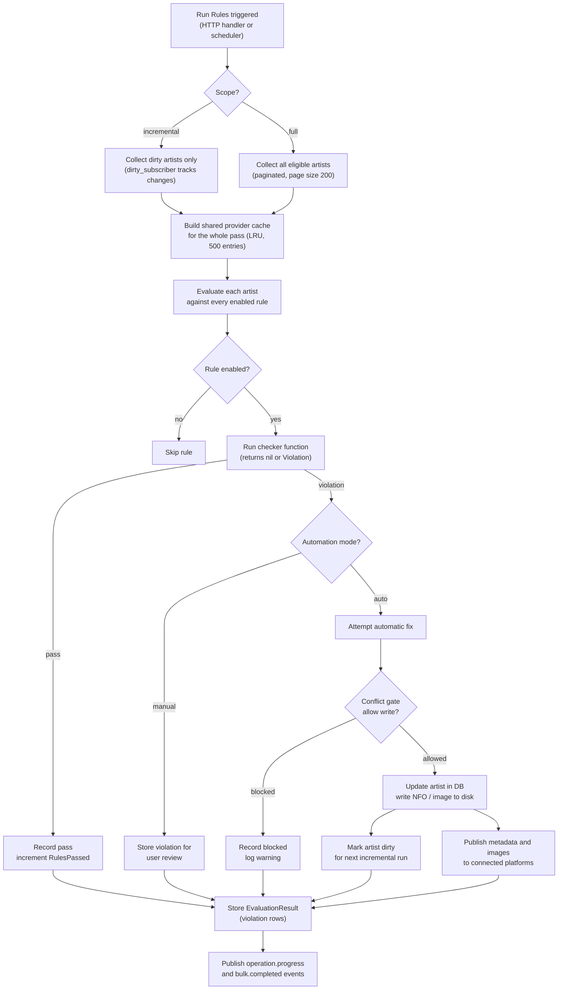

# Rule engine

The rule engine evaluates a configurable set of rules against every artist in
the library and records violations. Each rule has three modes: disabled,
manual, and auto. In auto mode the engine fixes violations without user
intervention; in manual mode it presents candidate fixes and waits for user
approval.

## Fix-all dispatch flow

The diagram below shows the path taken when a user (or the scheduler) triggers
a full rule run. The orchestration entry point is
`internal/rule.Service.RunAllScoped`.

Only one full rule run executes at a time. A second start attempt while a run
is in flight receives a 409 Conflict. An in-memory, mutex-protected progress
tracker coordinates the single active run and surfaces live progress to the UI
over SSE.

## Deferred-resolved rows and the persistence chain

Each evaluation run produces an `EvaluationResult` per artist (defined in
`internal/rule/model.go`). The service writes violation rows to the database
via `internal/rule.Service.StoreViolations`, keyed by `(artist_id, rule_id)`.
A previous violation row with `fixed=true` or `dismissed=true` is considered
resolved; a new row for the same pair supersedes it.

The `FixResult` struct (returned by each fixer) has three significant states:

| State | Meaning |
|---|---|
| `Fixed: true` | Fixer successfully applied the change; the violation is cleared |
| `Dismissed: true` | Violation is valid but no fix is possible (e.g. artist has no MBID); recorded so the user is not re-notified |
| Neither | Fixer attempted a fix but failed; violation stays open for retry |

After a successful fix, the fixer or the pipeline calls
`Publisher.PublishMetadata` or `Publisher.SyncImageToPlatforms` (both in
`internal/publish`) to propagate changes to connected Emby and Jellyfin
instances.

## Pass-level provider cache

During a run-all pass, many artists may share the same MusicBrainz ID or
need the same provider payload. Fetching it repeatedly for each artist wastes
network round-trips. `PassContext` (in `internal/rule/pass_context.go`) holds
an LRU cache (default 500 entries) that is shared across all artist
evaluations in a single `RunAllScoped` call. When a fixer writes changes for
an artist it must call `PassContext.Invalidate` for that artist so subsequent
re-evaluations see fresh data.

## Where to look

| Topic | File |
|---|---|
| Engine wiring and `Evaluate` | `internal/rule/engine.go` |
| `RunAllScoped`, `RunScope`, `FixResult` | `internal/rule/fixer.go` |
| `Rule`, `Violation`, `RuleConfig` model types | `internal/rule/model.go` |
| Checker registration and built-in checkers | `internal/rule/checkers.go` |
| Individual checkers | `internal/rule/checkers_*.go` |
| Fixer implementations | `internal/rule/fixers.go`, `internal/rule/fixers_*.go` |
| Bulk executor (fix-all job lifecycle) | `internal/rule/bulk_executor.go` |
| Pass-level provider cache | `internal/rule/pass_context.go` |
| Violation persistence | `internal/rule/sqlite_rule_results.go` |
| Dirty-artist tracking | `internal/rule/dirty_subscriber.go` |

See also [Architecture decisions](../architecture-decisions.md) for the ADRs
that shaped the rule engine's incremental-evaluation and automation-mode design.
