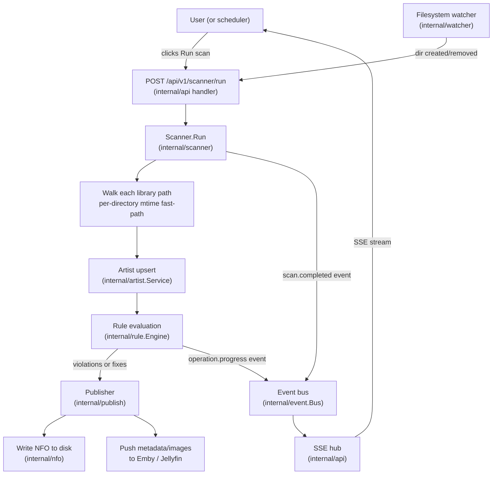

# Scanner pipeline

Stillwater keeps its artist database synchronized with the music library
through two complementary mechanisms: an explicit scan that walks the full
library on demand, and a filesystem watcher that triggers incremental updates
whenever the library changes on disk.

## Topology

## Filesystem watcher

`internal/watcher.Service` wraps `fsnotify` to watch each configured library
root directory. It debounces rapid successive events (default: 1 second) and
deduplicates the resulting scan triggers so a burst of filesystem activity
produces at most one scan kick rather than one per file change.

The watcher also maintains a polling fallback (`pollIntervals`,
`pollSnapshots`) for filesystems where `fsnotify` is unavailable or unreliable
(for example, some FUSE or network mounts). The poll interval per path is
stored in `pollIntervals` and checked each time the poll ticker fires.

`internal/watcher.ExpectedWrites` is a thread-safe set that the scanner and
publisher populate with file paths they are about to write. The watcher
suppresses `FSUnexpectedWrite` events for paths in this set and removes them
after the write is acknowledged, preventing Stillwater's own writes from
triggering a redundant scan.

## Library scanner

`internal/scanner.Service.Run` starts a background goroutine that:

1. Resolves the list of libraries to scan from `internal/library.Service`.
2. Walks each library root, probing each subdirectory for known image
   filenames (`folder.jpg`, `fanart.jpg`, `logo.png`, `banner.jpg`, etc.) and
   parsing `artist.nfo` if present.
3. Applies a mtime fast-path: if a directory's modification time has not
   changed since the last scan, the inner image probe and NFO parse are
   skipped. This makes incremental scans near-instant on large, stable
   libraries. Disable via `SetMtimeFastPath(false)` on filesystems that do
   not maintain reliable directory mtimes.
4. Upserts each artist into the database via `internal/artist.Service`, then
   passes the artist to `internal/rule.Engine.Evaluate`.

Only one scan runs at a time. `Run` returns `ErrScanInProgress` if called
while a scan is already running.

## Event bus

`internal/event.Bus` is an in-process, channel-backed pub/sub bus. Publishers
call `Publish(Event)` which is non-blocking: if the buffer is full, the event
is dropped with a warning log (except `ConnectionPushFailed` events which are
logged at error level). Subscribers register via `Subscribe(EventType, Handler)`.

Key event types produced by the scanner pipeline:

| Event type | Produced by | Consumed by |
|---|---|---|
| `scan.completed` | Scanner goroutine | SSE hub (triggers browser refresh) |
| `artist.new` | Scanner (first upsert) | SSE hub |
| `operation.progress` | Rule service (run-all progress) | SSE hub (progress pill) |
| `fs.dir.created` | Watcher | Scanner (triggers partial scan) |
| `fs.dir.removed` | Watcher | Scanner |
| `fs.unexpected.write` | Watcher | SSE hub (toast notification) |

## Publisher

`internal/publish.Publisher` is the single place where Stillwater writes
metadata and images to external destinations. It is called after every
successful DB update (whether from the scanner, the rule engine, or a manual
edit) and performs two categories of work:

- **NFO write**: calls `internal/nfo` to render and atomically write the
  `artist.nfo` file to the artist's directory. The write is guarded by the
  conflict gate before execution.
- **Platform push**: fans out to each enabled and configured connection
  (Emby, Jellyfin) via fire-and-forget goroutines. Errors are surfaced as
  `connection.push_failed` events on the event bus, which the SSE hub
  delivers to the browser as a toast notification.

The publisher adds each planned write path to `ExpectedWrites` before writing
and removes it afterward so the filesystem watcher does not treat Stillwater's
own output as an unexpected external change.

## Where to look

| Topic | File |
|---|---|
| Watcher service, fsnotify loop | `internal/watcher/watcher.go` |
| Expected-writes tracker | `internal/watcher/expected_writes.go` |
| Scanner service, `Run`, mtime fast-path | `internal/scanner/scanner.go` |
| Event type constants | `internal/event/bus.go` |
| Publisher, NFO write, platform push | `internal/publish/publisher.go` |
| NFO rendering | `internal/nfo/` |

See also [Conflict gate](conflict-gate.md) for how the publisher decides
whether a write is permitted.
