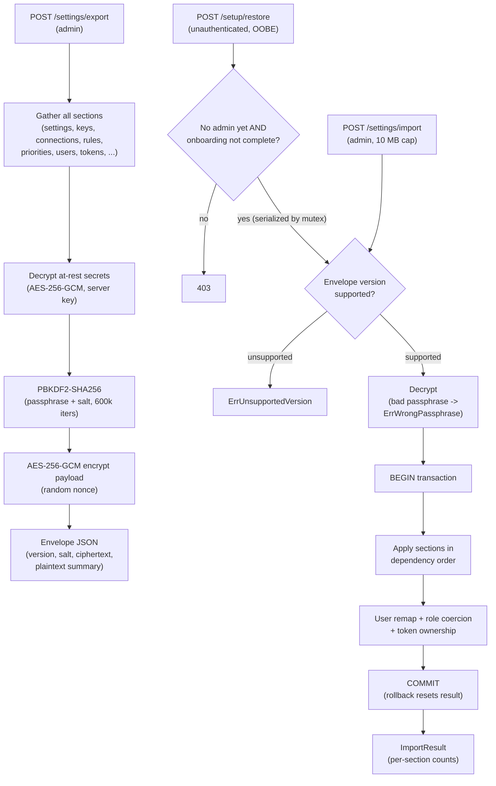

# Settings import/export

The settings import/export subsystem (`internal/settingsio`) snapshots all
operator configuration into a passphrase-encrypted bundle and re-applies it on
the same or a different instance. The entry points are `Service.Export` and
`Service.ImportWithOptions` in `internal/settingsio/export.go`. Three routes
expose the feature: `POST /api/v1/settings/export` and
`POST /api/v1/settings/import` for authenticated admins, and
`POST /api/v1/setup/restore` for the pre-admin out-of-box-experience (OOBE)
restore.

## Export and import flow

Export gathers every section, decrypts at-rest secrets so the receiving
instance does not need the source server's key, marshals the payload, then
encrypts the whole blob under a user passphrase. Import reverses this: it checks
the envelope version, decrypts, then applies every section inside a single
database transaction in dependency order (connections before libraries, users
before user preferences and tokens). The OOBE restore path shares the import
machinery but adds two gates and a serialization mutex.

## Envelope versioning

The outer envelope carries a `version` string identifying the payload schema.
`CurrentEnvelopeVersion` (`internal/settingsio/export.go`) is the version
emitted by `Export`. Import rejects any version outside the supported set with
`ErrUnsupportedVersion`; an empty version is treated as the oldest schema for
backward compatibility. Version-gating helpers prevent a field absent from an
older envelope (for example `verify_path_after_update`, added in a later
version) from overwriting the target's live value with a decoded zero. The
version history is authoritative in the doc comment on `CurrentEnvelopeVersion`
and is generated into the table below by `cmd/gen-envelope-changelog`:

--8<-- "docs/_generated/envelope-versions.md"

## Encryption boundary

The envelope has two layers of secrecy. Secrets held encrypted at rest
(connection and provider API keys) use `internal/encryption.Encryptor`,
AES-256-GCM under a server-managed 32-byte key generated at startup. These are
decrypted into the payload before export so the receiving instance does not need
the source key. The whole payload is then re-encrypted for transit and storage
under a user passphrase: the key is derived with PBKDF2-SHA256 over a random
16-byte salt and 600,000 iterations (`pbkdf2Iterations`), and the payload is
sealed with AES-256-GCM. The envelope's plaintext `summary` (section counts)
sits outside the ciphertext so operators can inspect a bundle before importing
it. A wrong passphrase fails AES-GCM tag verification, surfaced as
`ErrWrongPassphrase`. (A standalone Encryption-boundary page covering at-rest
scope across the whole app is a planned follow-up; the export path is the
densest use of the boundary, so it is documented here.)

Because at-rest secrets are sealed under a per-install server key, they cannot
cross instances as raw ciphertext -- the target instance holds a different key
and could never decrypt them. Provider API keys are therefore carried only by
the dedicated `ProviderKeys` payload section: they are decrypted at export and
re-encrypted under the target instance key on import. They are deliberately
**not** carried by the generic `settings` key-value dump. An earlier version did
duplicate `provider.<name>.api_key` and `provider.<name>.key_status` into that
generic blob as source-encrypted ciphertext, which caused an import-order
collision: the dedicated section re-encrypted the key correctly, then the
generic-settings apply overwrote it with the undecryptable source ciphertext,
leaving the key unusable on the target (#2277). The import side now skips those
two provider-owned key rows unconditionally for all envelope versions, so older
bundles that still carry the duplicated rows are repaired rather than corrupted.
This split exists precisely because an encrypted-at-rest value needs the
decrypt-at-source / re-encrypt-at-target handling that a plaintext key-value
blob cannot provide; plaintext provider settings (base URL, rate limits, field
verbosity, priorities) have no such need and continue to round-trip through the
generic `settings` dump.

One known, separate limitation: a custom MusicBrainz mirror `base_url`
round-trips to the database but is not live-applied to the running adapter until
restart. That is out of scope here -- the API mirror handlers are the only
live-reload path and are not reachable from `settingsio`.

## Transactional per-section apply

`ImportWithOptions` wraps every section write in one `sql.Tx`. A deferred
rollback fires on any section failure and resets the result struct to zero, so
callers never see a partially applied import. Sections run in dependency order
because later rows reference earlier ones: library rows remap onto
freshly-written connection rows, and user preferences and API tokens remap onto
freshly-written user rows. Each section helper accepts a `dbExecutor` interface
so it runs against the transaction without a signature change. On commit the
result carries per-section upsert counts plus skip counters for rows
intentionally omitted (for example a library whose connection is absent on the
target).

## User remap, role coercion, and OOBE restore

`importUsers` (`internal/settingsio/users.go`) dispatches per row. For envelopes
that carry a stable UUID, an id hit updates the existing row (a protected target
row is updated narrowly, leaving `role` untouched so the
`prevent_role_change_protected_user` trigger does not fire); a username
collision under a different id halts the import with `ErrUserIDCollision`; a
clean miss inserts with the source UUID. `normalizeImportRole` coerces any role
outside the known set down to `operator` (least privilege), and `is_protected`
is forced off if the target already has a protected admin, preserving the
single-protected-admin invariant. Token attribution
(`internal/settingsio/tokens.go`) uses the same id-first, username-fallback,
admin-fallback ladder. The OOBE handler
(`internal/api/handlers_setup_restore.go`) is CSRF-exempt and login-rate-limited;
it acquires `setupRestoreMu` and re-checks "no users yet" and "onboarding not
complete" under that lock to close the TOCTOU window before importing. It marks
onboarding complete outside the import transaction as a deliberate fail-soft, so
a restored database is never left half-applied.

## Where to look

| Topic | File |
|---|---|
| `Payload`, `Envelope`, `CurrentEnvelopeVersion`, `pbkdf2Iterations`, `Export`, `ImportWithOptions` | `internal/settingsio/export.go` |
| User remap, `ErrUserIDCollision`, `normalizeImportRole` | `internal/settingsio/users.go` |
| Token ownership remap | `internal/settingsio/tokens.go` |
| Export/import handlers, `maxImportSize` | `internal/api/handlers_settings_io.go` |
| OOBE restore handler, gates, serialization mutex | `internal/api/handlers_setup_restore.go` |
| At-rest encryption (AES-256-GCM) | `internal/encryption/encryption.go` |
| Envelope-version changelog generator | `cmd/gen-envelope-changelog/main.go` |

See also [Architecture decisions](../architecture-decisions.md) for the portable
settings contract ADR, which records the cross-instance ownership semantics, the
role-coercion and protected-admin invariants, and the admin-fallback trust
tradeoff.
