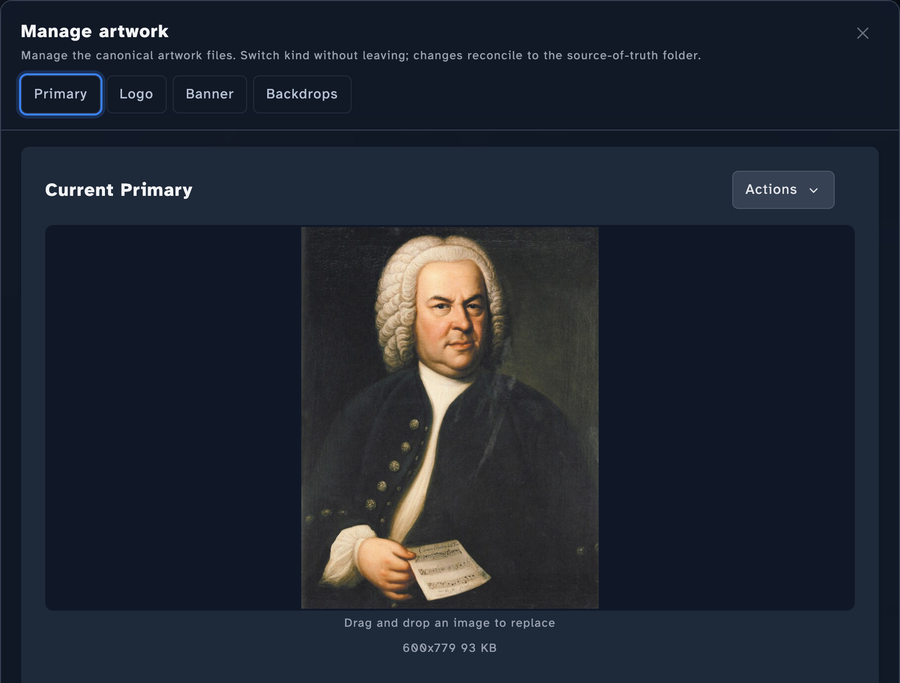

<!-- code: internal/image/processor.go (IsLowResolution defaults), internal/image/save.go (logo PNG conversion), internal/image/fanart.go (FanartFilename Kodi vs Emby/Jellyfin), internal/image/naming.go (DefaultFileNames, ImageTermFor), internal/imagebridge/bridge.go, internal/api/handlers_image.go (maxUploadSize 25MB), internal/rule/service.go (thumb_min_res, fanart_min_res, logo_min_res, banner_min_res default thresholds + RuleConfig MinWidth/MinHeight) -->

# Images

Stillwater handles four image slots per artist: **thumb**, **fanart**, **logo**, and **banner**. Each one has a job in the platforms it ends up in, and each has a corresponding rule (or set of rules) that decides what "good enough" looks like for your library.

## The four slots

| Slot | What it is | Where you'll see it |
|---|---|---|
| Thumb | Square portrait of the artist | Artist tiles, "Now playing" |
| Fanart | Wide landscape backdrop. Multiple per artist allowed. | Background of artist pages, slideshows |
| Logo | Transparent-background artist logo | "Now playing" overlays, hero banners |
| Banner | Wide horizontal art | List views on some platforms |

## Resolution and aspect: rule-driven, configurable

Stillwater doesn't reject low-resolution images on its own -- it stores them and tags them, and a **rule** decides whether to flag the result as a problem. That means the "minimum acceptable resolution" for each slot is something you can change.

The rules that govern image quality, with their defaults:

| Rule | Default threshold |
|---|---|
| **Thumbnail minimum resolution** | 500 x 500 |
| **Thumbnail is square** | 1:1 ratio (10% tolerance) |
| **Fanart minimum resolution** | 1920 x 1080 |
| **Fanart aspect ratio** | 16:9 (10% tolerance) |
| **Logo minimum width** | 400 |
| **Banner minimum resolution** | 1000 x 185 |

Adjust any of them under **Settings > Rules**. If your collection ships from sources that struggle to reach 1920x1080 fanart, drop the threshold and the rule stops nagging. Two related rules without dimension thresholds:

- **Logo excessive padding** -- flags logos with too much whitespace around the artwork. Defaults to 15% of the image area; auto-fix can trim them.
- **Backdrop minimum count** -- flags artists with fewer fanart variants than you'd like.

The full [rules catalogue](../reference/rules-catalogue.md) lists every image rule with its configurable knobs.

## Multi-fanart

Fanart is the only slot that supports more than one image per artist. Stillwater stores them as numbered files alongside the primary, with platform-specific numbering:

- **Emby / Jellyfin:** `fanart.jpg`, `fanart2.jpg`, `fanart3.jpg`, ...
- **Kodi:** `fanart.jpg`, `fanart1.jpg`, `fanart2.jpg`, ...

The artist record reflects how many fanart files exist on disk. Other slots are single-image: writing a new thumb replaces the previous one.

**Where to manage artwork:** open an artist from the **Artists** list, then open **Manage artwork** from the artist's Artwork section. The modal has a tab for each slot -- **Primary**, **Logo**, **Banner**, and **Backdrops** -- and you switch between them without leaving the modal; changes reconcile to the source-of-truth folder. Each tab shows the current image with an **Actions** menu (fetch from providers, web search, browse, or fetch from a URL) and a drag-and-drop target to replace it.

## Where the images come from

Three paths feed the four slots:

1. **Manual upload.** Drag a file onto the artist page (or paste a URL). Maximum upload size is 25 MB.
2. **Provider fetch.** A metadata provider (Fanart.tv, AudioDB, MusicBrainz) returns a URL; Stillwater downloads it. See [providers](providers.md).
3. **Platform mirror.** When the artist exists in a connected Emby or Jellyfin instance, Stillwater can fetch the image directly from the platform and save it locally. Useful when the platform already has a curated image you'd like to mirror.

After fetch, you can crop the result in-browser before saving. The cropper is the easiest way to bring a tall promotional poster down to a square thumb without losing the subject.

## Platform terminology

The same image slot has different names in different platforms:

| Stillwater slot | Kodi | Emby / Jellyfin |
|---|---|---|
| Thumb | Folder | Primary |
| Fanart | Fanart | Backdrop |
| Logo | Logo | Logo |
| Banner | Banner | Banner |

Stillwater's UI shows the platform-appropriate label when a library is associated with a platform profile -- so an Emby-imported library shows "Primary" / "Backdrop" instead of "Thumbnail" / "Fanart", matching what you'd see in Emby itself.

## What you don't need to think about

- **Format conversion.** Stillwater writes the right format per slot. Logos always end up as PNG so transparency is preserved; everything else stays in its source format.
- **Multi-fanart numbering.** The platform profile decides whether a second fanart is `fanart1.jpg` or `fanart2.jpg`. Drop in a new fanart and it picks the right name.
- **Filename variants.** Some platforms want the same image under multiple names (`folder.jpg` and `artist.jpg`). Stillwater writes one real file and creates symlinks for the alternate filenames where the filesystem supports it.

What you do think about: which images you want for which artists, whether the rule defaults match your standards, and whether to accept low-resolution placeholders or hold out for something better. Rules and the [fix-all flow](rules.md) make the second question a batch operation rather than a per-artist click-through.
