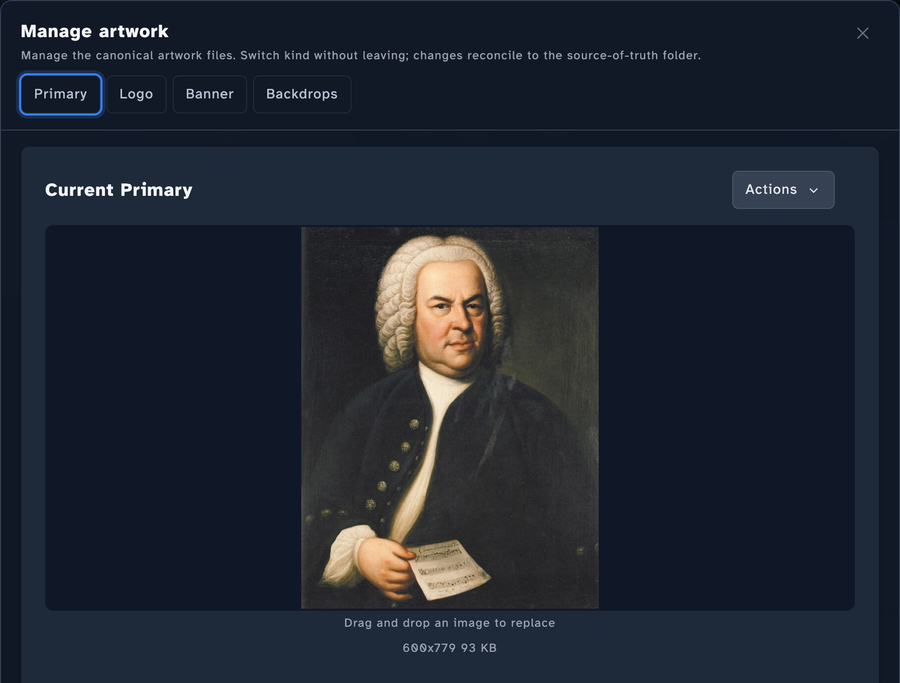

<!-- code: internal/image/processor.go (IsLowResolution defaults), internal/image/save.go (logo PNG conversion), internal/image/fanart.go (FanartFilename Kodi vs Emby/Jellyfin), internal/image/naming.go (DefaultFileNames, ImageTermFor), internal/imagebridge/bridge.go, internal/api/handlers_image.go (maxUploadSize 25MB), internal/rule/service.go (thumb_min_res, fanart_min_res, logo_min_res, banner_min_res default thresholds + RuleConfig MinWidth/MinHeight), internal/image/artwork_subdir.go (ListArtworkSubdirFiles), internal/publish/publisher.go (extrafanartExposureWarning, uploadFanartSetIssued, skipPastNilSlot), internal/publish/reconcile.go (fanartDeficit) -->

# Images

Stillwater handles four image slots per artist: **thumb**, **fanart**, **logo**, and **banner**. Each one has a job in the platforms it ends up in, and each has a corresponding rule (or set of rules) that decides what "good enough" looks like for your library.

## The four slots

| Slot | What it is | Where you'll see it |
|---|---|---|
| Thumb | Square portrait of the artist | Artist tiles, "Now playing" |
| Fanart | Wide landscape backdrop. Multiple per artist allowed. | Background of artist pages, slideshows |
| Logo | Transparent-background artist logo | "Now playing" overlays, hero banners |
| Banner | Wide horizontal art | List views on some platforms |

## Resolution and aspect: rule-driven, configurable

Stillwater doesn't reject low-resolution images on its own -- it stores them and tags them, and a **rule** decides whether to flag the result as a problem. That means the "minimum acceptable resolution" for each slot is something you can change.

The rules that govern image quality, with their defaults:

| Rule | Default threshold |
|---|---|
| **Thumbnail minimum resolution** | 500 x 500 |
| **Thumbnail is square** | 1:1 ratio (10% tolerance) |
| **Fanart minimum resolution** | 1920 x 1080 |
| **Fanart aspect ratio** | 16:9 (10% tolerance) |
| **Logo minimum width** | 400 |
| **Banner minimum resolution** | 1000 x 185 |

Adjust any of them under **Settings > Rules**. If your collection ships from sources that struggle to reach 1920x1080 fanart, drop the threshold and the rule stops nagging. Two related rules without dimension thresholds:

- **Logo excessive padding** -- flags logos with too much whitespace around the artwork. Defaults to 15% of the image area; auto-fix can trim them.
- **Backdrop minimum count** -- flags artists with fewer fanart variants than you'd like.

The full [rules catalog](../reference/rules-catalogue.md) lists every image rule with its configurable knobs.

## Multi-fanart

Fanart is the only slot that supports more than one image per artist. Stillwater stores them as numbered files alongside the primary, with platform-specific numbering:

- **Emby / Jellyfin:** `fanart.jpg`, `fanart2.jpg`, `fanart3.jpg`, ...
- **Kodi:** `fanart.jpg`, `fanart1.jpg`, `fanart2.jpg`, ...

The artist record reflects how many fanart files exist on disk. Other slots are single-image: writing a new thumb replaces the previous one.

### `extrafanart/` is outside Stillwater's protection

Kodi and Emby both support an `extrafanart/` subdirectory inside an artist's folder, for backdrops beyond what a platform's own numbered-file scheme covers. Stillwater does not look inside it during normal operation: files left there are invisible to Stillwater's fanart discovery, are never counted in the artist record, and are never part of the set Stillwater pushes to a connected platform. Stillwater does not move them on its own. A migration moves them up into the artist folder, where they become ordinary fanart: you can [preview and run it](../how-to/migrate-extrafanart.md) from its page or through the API. It is one-way and never deletes an image. A [merge of duplicate artists](../how-to/merge-duplicate-artists.md) still combines both artists' `extrafanart/` folders without losing an image, and it tells you when the surviving artist is left holding images there, so you know there is something to migrate.

That has a consequence beyond simply "not managed." When Stillwater pushes fanart, a connected platform can respond by clearing and rewriting the artwork it manages for that artist. On at least one measured platform, a file sitting in `extrafanart/` has been progressively lost across repeated pushes as a result, with no way to recover it afterward. If you use `extrafanart/`, treat it as unprotected. When a fanart push you trigger yourself runs -- from the artist's artwork tools -- Stillwater warns you once for that push, after it has run, if the artist's `extrafanart/` folder holds files. The warning does not stop the push and does not make the files safe. Three things narrow it, and all three are deliberate:

- **It only appears when a fanart push actually reaches a connected platform.** If nothing was pushed to any platform, nothing there can be cleared and rewritten, so no warning is raised. That covers an artist Stillwater finds no readable top-level fanart for, and it equally covers a push where every mapped connection was skipped -- because it is disabled, unhealthy, of a type Stillwater cannot upload to, or, on the background pass, because **Image download/write** is off.
- **The background reconciliation pass does not warn you on screen.** That pass pushes fanart too, and the exposure is the same, but it runs on a timer with nobody watching -- so its warning is written to Stillwater's log rather than shown to you. If you rely on `extrafanart/`, the log is where that one appears.
- **If the check itself cannot run, Stillwater says so** rather than staying quiet: an unresponsive library mount means it cannot count the files, and you are told the check was skipped, not that the folder is empty.

Back them up outside your library if they matter to you.

### Replacing the primary fanart on a connected platform

When Stillwater treats a fanart edit as a straightforward replace of the current primary backdrop -- not adding a new backdrop, and not editing one particular numbered backdrop through the Backdrops gallery -- it pushes that change to Emby and Jellyfin. This push only happens for a connection that's enabled and healthy; a disabled or unhealthy connection sees no push at all. (The **Image download/write** toggle governs Stillwater's separate background reconciliation pass, not a replace you trigger yourself -- turning it off does not stop this push.)

- **Emby** replaces the backdrop in place. The platform's backdrop count stays the same and the addressed slot's image content changes.
- **Jellyfin's upload endpoint still doesn't honor the slot it's given** -- that's a Jellyfin server limitation, not something Stillwater's client code controls, and it hasn't changed. Stillwater works around it: it clears every backdrop that artist has on the connected server and re-uploads your full local set in order, so the count comes out the same and the primary slot's content is the one that changed. There's a brief moment mid-sync where that artist has no backdrops on Jellyfin at all, while the old set is cleared and the new one goes back up. Other artists are untouched.
- If a local backdrop can't be read, or is too large for Stillwater to hold in memory during that resync, Stillwater refuses the whole thing rather than deleting a set it can't rebuild -- your Jellyfin backdrops are left exactly as they were, and you'll see a warning naming which backdrop (by its position in the set) could not be captured. Fix or remove the offending file and try again.

**On Jellyfin, every fanart push replaces the artist's whole backdrop list with your local set.** That includes any backdrop that exists only on Jellyfin, such as one you added in Jellyfin's own artwork manager: the next push deletes it. Keep artwork you want to retain in the artist's local folder. The Backdrops gallery's per-image tools (cropping or re-fetching one specific backdrop from its own tile), reordering, deleting, batch-deleting, and assigning a backdrop pulled from a connected platform all push your full local fanart set, and the background reconciliation pass does too, so each of them clears that artist's Jellyfin backdrops and re-uploads the whole set in order. Repeating one of these actions leaves the same count as your local set, never a growing one. The same brief moment with no backdrops on Jellyfin applies.

As with the primary replace, Stillwater refuses the push and deletes nothing if any local backdrop can't be read, or if the set is larger than Stillwater will hold in memory at once. You'll see a warning naming which backdrop (by its position in the set) could not be captured; the fix is to repair or remove that file. If a push fails partway, after the old set was cleared, the warning says which backdrop did not upload, so an incomplete set is never reported as a success. If Jellyfin refuses to delete one of the existing backdrops, Stillwater stops there without uploading anything, so the old backdrops are never left ahead of the new set; the warning says the upload was skipped, and the next push starts the rebuild over.

**On Emby, a backdrop that can't be read or is too large is skipped and the others are kept.** This covers any push of your full backdrop set: the Backdrops gallery tools, reordering, deleting, and the background pass. Emby is not cleared and rebuilt, so Stillwater pushes every backdrop it can capture, in your local order, and leaves the skipped one out.

- If the server does not yet hold a backdrop at the skipped file's position or beyond, the backdrops after it move up on Emby to close the gap but keep their order. Pushing the same set again does not duplicate them or grow the count.
- If the server already holds a backdrop at that position, for example because the set was pushed while the file was still readable, each backdrop stays in its own position and nothing shifts. Whatever backdrop Emby already holds at the skipped file's position is left untouched; if that file was pushed earlier, that is the copy Emby keeps showing.
- If Emby itself can't be read at that moment, Stillwater cannot check whether the later backdrops are already there. It holds them back for the next push and reports a warning saying so (on screen for a push you start, in the log for the background pass), rather than risk adding duplicates.
- Once you fix the file, the next push restores the full order. If you remove it instead, the next push puts the remaining backdrops in order; because pushes to Emby only add or replace, a server that held the full set keeps one surplus copy at the end, which the [Platform Backdrop Duplicates](../how-to/view-reports.md) report can prune.

The background reconciliation pass does not keep re-pushing because of a file it can't read; once the file is readable and the server is short of it, a later pass pushes it without any action from you.

A backdrop that can't be read also shows up on the artist as a finding, titled **Backdrop file cannot be read** on the artist and under **Fanart file cannot be read** in Settings > Rules. Its message names the unreadable files, for example `Unreadable: fanart2.jpg`, so you know which one to fix. If the backdrop set is over the size or count limit for one push, the files left out are named too, with that as the reason. The finding is informational: there is no fix button, and Stillwater never touches the file. You can dismiss it. It clears the next time Stillwater reads that artist's backdrops for a push and finds them all readable (or finds none left). The background pass only reads an artist's backdrops when the media server is missing some, so a finding can stay until your next push of that artist's backdrops. See the [Rules catalog](../reference/rules-catalogue.md) for the full description.

**Where to manage artwork:** open an artist from the **Artists** list, then open **Manage artwork** from the artist's Artwork section. The modal has a tab for each slot -- **Primary**, **Logo**, **Banner**, and **Backdrops** -- and you switch between them without leaving the modal; changes reconcile to the source-of-truth folder. Each tab shows the current image with an **Actions** menu (fetch from providers, web search, browse, or fetch from a URL) and a drag-and-drop target to replace it.

## Where the images come from

Three paths feed the four slots:

1. **Manual upload.** Drag a file onto the artist page (or paste a URL). Maximum upload size is 25 MB.
2. **Provider fetch.** A metadata provider (Fanart.tv, AudioDB, MusicBrainz) returns a URL; Stillwater downloads it. See [providers](providers.md).
3. **Platform mirror.** When the artist exists in a connected Emby or Jellyfin instance, Stillwater can fetch the image directly from the platform and save it locally. Useful when the platform already has a curated image you'd like to mirror.

After fetch, you can crop the result in-browser before saving. The cropper is the easiest way to bring a tall promotional poster down to a square thumb without losing the subject.

## Platform terminology

The same image slot has different names in different platforms:

| Stillwater slot | Kodi | Emby / Jellyfin |
|---|---|---|
| Thumb | Folder | Primary |
| Fanart | Fanart | Backdrop |
| Logo | Logo | Logo |
| Banner | Banner | Banner |

Stillwater's UI shows the platform-appropriate label when a library is associated with a platform profile -- so an Emby-imported library shows "Primary" / "Backdrop" instead of "Thumbnail" / "Fanart", matching what you'd see in Emby itself.

## What you don't need to think about

- **Format conversion.** Stillwater writes the right format per slot. Logos always end up as PNG so transparency is preserved; everything else stays in its source format.
- **Multi-fanart numbering.** The platform profile decides whether a second fanart is `fanart1.jpg` or `fanart2.jpg`. Drop in a new fanart and it picks the right name.
- **Filename variants.** Some platforms want the same image under multiple names (`folder.jpg` and `artist.jpg`). Stillwater writes one real file and creates symlinks for the alternate filenames where the filesystem supports it.

What you do think about: which images you want for which artists, whether the rule defaults match your standards, and whether to accept low-resolution placeholders or hold out for something better. Rules and the [fix-all flow](rules.md) make the second question a batch operation rather than a per-artist click-through.

## See also

- [Merge duplicate artists](../how-to/merge-duplicate-artists.md) -- when two artist records with images merge, loose files are handled per-file: if the survivor already has a same-named file, the survivor's copy wins and the loser's copy is deleted; a uniquely-named loser image is moved into the survivor's directory and kept. The `extrafanart`/`extrathumbs` folders are the one exception -- both sides' images are kept and merged together rather than treated as a collision. If the survivor is left with images in `extrafanart/`, the merge reports it and points to the [migration](../how-to/migrate-extrafanart.md).
