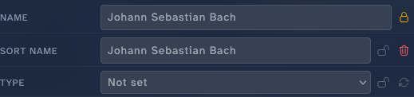
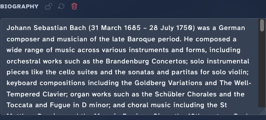
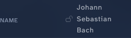
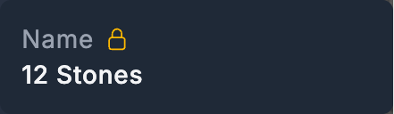

<!-- code: internal/api/router.go (PATCH /api/v1/artists/{id}/fields/{field}; POST/DELETE /api/v1/artists/{id}/lock + field-locks), internal/api/handlers_field_update*.go, internal/api/handlers_locks*.go, web/templates/artist_detail.templ, web/static/js/artist-detail/section-layout.js. -->

# Edit an artist

Most metadata in Stillwater comes from providers. Sometimes you want to override a value, pin one in place, or curate something the providers don't supply. This page covers the manual-edit paths.

## Edit a field

In read mode the **Details** section just shows each field's value with a lock padlock beside it -- there are no per-field edit pencils or overflow menus. Editing is a mode you switch the whole section into.

1. Open the artist's page. The **Details** section (the first accordion section, holding Identity, Tags, and Biography) is where the editable metadata lives.
2. Click the **Edit** button in the Details section header. Every field swaps to an inline editor: text inputs for Name, Sort Name, and the rest; a dropdown for Type; chip editors for Genres, Styles, and Moods; a textarea for Biography.
3. Change the value you want.
4. As soon as a field changes, its own **Save** and **Cancel** controls appear. Click **Save** to commit that field or **Cancel** to revert it -- each field saves independently.
5. Click **Done** in the section header to leave edit mode.

{ width="420" }

Next to each field's editor sit small icons: a **lock** toggle to pin the field, a **fetch** icon to pull just that field from providers, and a **clear** icon to empty it. Committed changes appear in the artist's history alongside provider attributions.

### Editing list fields

Genres, styles, and moods are list fields. In edit mode their editor lets you type a new value into a text input to add it; click the **X** on an existing chip to remove one. The order matters for some platforms (the first genre is often the "primary" one).

## Revert a field to a prior value

Fields that have recorded prior values show a small **clock icon** (labeled "Prior values for \<Field\>") next to the field's edit controls in edit mode.

Prior values accrue automatically from manual edits, provider metadata refreshes, and automated rule fixes -- you do not need to do anything to start collecting them.

To revert a field:

1. Click the **clock icon** next to the field. A popover opens listing up to five recent prior values, most recent first, each showing its source and timestamp.
2. Click the value you want to restore. It is staged back into the field's input and the field is marked changed.
3. Click **Save** to apply it (or **Cancel** to discard the staged value).

This is the per-field undo path. There is no global "undo all" -- each field manages its own history independently.

!!! note
    The previously separate **History** section (a dedicated tab listing all field changes) has been removed. Per-field prior values replace it for day-to-day revert workflows.

## Lock the artist

Locking the artist means: future automated runs (provider refreshes, rule fixers) skip this record entirely. The big switch.

1. On the artist's page, click the **lock** button (next to the name).
2. The lock toggles. The button reflects the new state, and a small lock indicator appears next to fields the lock now protects.

When locked, Stillwater also adds `<lockdata>true</lockdata>` to the NFO file the next time it writes one. That asks platforms (Kodi, Emby, Jellyfin) to leave the file alone too.

To unlock, click the lock button again.

## Lock a single field

Sometimes you want most of an artist's metadata to refresh from providers, but two or three fields you've curated should stay put.

1. On the artist's page, find the field you want to pin in the **Details** section. A small open-lock padlock (gray) sits next to its value -- these padlocks show in read mode, so you do not need to enter edit mode to set a lock.
2. Click the padlock. It immediately switches to a closed amber lock; the field is now skipped on future refreshes.
3. While locked, the field's inline editing controls stay hidden even in edit mode -- you can't accidentally change a pinned value. Click the closed padlock again to unlock.

{ .sw-hover-after }
Hover or focus to lock

Per-field locks are independent of the whole-artist lock. You can have an unlocked artist with three pinned fields, or a locked artist with the lock removed from one field (rarely useful, but supported).

## Reorder fanart

When an artist has multiple fanart images, the first one is "primary" -- it's the one shown in slideshow positions where only one fanart fits.

1. Open the artist's **Artwork** section.
2. Hover (or focus) any non-primary fanart in the gallery. A small star button appears on the overlay. Click the star to promote that fanart to primary; the others keep their existing order behind it. (Clicking the thumbnail itself opens the lightbox for full-size viewing -- the star is the promotion control.)
3. For finer rearrangement, open **Manage artwork** and use the up/down buttons in the **Backdrops** tab. The order saves immediately and the files on disk are renumbered to match.

Renumbering follows the platform profile's convention -- so the resulting order yields `fanart.jpg, fanart2.jpg, fanart3.jpg` for Emby/Jellyfin, or `fanart.jpg, fanart1.jpg, fanart2.jpg` for Kodi.

## Manually upload an image

When providers don't have what you want, upload directly.

1. Open the artist's **Manage artwork** modal and switch to the slot's tab (Primary, Logo, Banner, or Backdrops).
2. Drag a file onto the drop target, or open the **Actions** menu and choose **Browse**.
3. (Optional) Crop the image in the in-browser cropper before saving.
4. Click **Save**.

Uploads up to 25 MB are accepted.

## Add or change a provider ID

Most provider IDs are discovered automatically as Stillwater queries providers and follows links between them. When you need to set one manually:

1. Open the artist's page and find the **Provider IDs** section (MusicBrainz, AudioDB, Discogs, Wikidata, Deezer, Spotify).
2. Switch it into edit mode with its **Edit** control. Each ID becomes an inline input.
3. Paste the ID into the right provider's field.
4. Save the field.

Setting an ID does not trigger a refresh on its own -- the next refresh will use the new ID. To pull updated data immediately, click **Refresh** after saving.

## Reorder and collapse sections

Below the hero, the artist's sections (Details, Artwork, Findings, Providers, Discography, Identifiers) are individually reorderable and collapsible.

1. Hover (or focus) a section's header to reveal its drag handle.
2. Drag the handle to move that section up or down. The new order saves automatically as soon as you drop it.
3. Click a section's disclosure control to collapse or expand it. The collapsed state saves alongside the order.

Both settings are per-user preferences (`artist_detail_section_order`, `artist_detail_collapsed_sections`), so the layout follows you across artists and sessions. You can also set the section order and hidden sections from the preferences drawer -- see [Customize your view](customize-preferences.md).

## Scroll with the sticky mini-header

Once you scroll past the hero, a compact mini-header takes its place at the top of the page: the artist's name and type, a findings indicator (when there are open findings), and the same **Edit** and **Actions** controls as the hero. It lets you edit, run rules, or jump back to the artist list without scrolling back up.

## Keyboard shortcuts

The artist page responds to these keys (not while a text field is focused):

| Key | Action |
| --- | --- |
| `h` | Previous artist |
| `l` | Next artist |
| `j` | Next section |
| `k` | Previous section |
| `r` | Refresh metadata |
| `R` | Run rules |
| `e` | Toggle edit mode |
| `f` | Fetch from providers for the field your cursor is over |
| `Esc` | Close the open panel, or exit edit mode |

A shortcut legend with the same keys is printed at the bottom of the page.

## Discard accidental edits

There's no global "undo." Two ways to recover:

- **Refresh** -- pulls fresh values from providers, overwriting your unsaved changes (only on unlocked fields). Use when the original came from providers anyway.
- **Snapshot restore** -- if a snapshot exists from before the edit (Stillwater takes one before fix-all runs), the snapshot panel lets you restore it.

## What edits don't do

- They don't write the NFO file immediately. The artist record updates; the NFO is rewritten on the next save action that touches disk (or by a fixer). The "Save NFO" button on the artist page forces an immediate write.
- They don't touch images. Field edits and image edits are independent.
- They don't broadcast to connected platforms automatically. The platform sees the change at its next metadata refresh, which it controls. Some platforms can be poked via webhook.

## See also

- [Field locks](../core-concepts/field-locks.md) for the bigger picture on the two lock layers plus the library-wide NFO lockdata switch.
- [Refresh metadata](refresh-metadata.md) when you want providers to overwrite unlocked fields.
- [Fetch and crop images](fetch-and-crop-images.md) for image-specific workflows.
