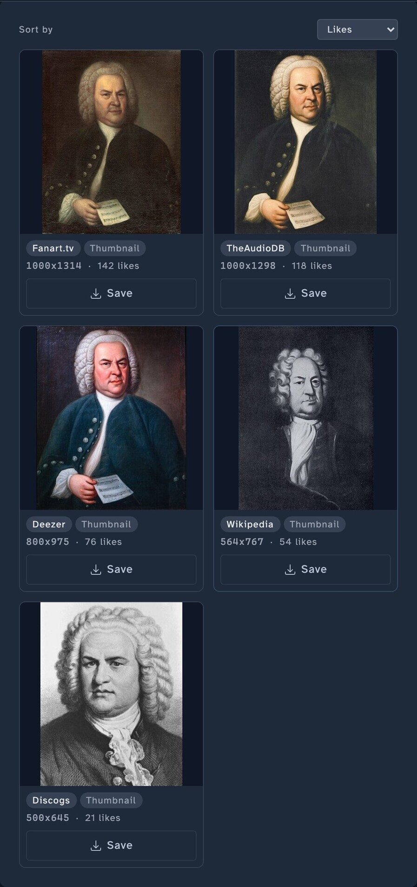

<!-- code: internal/api/router.go (POST /artists/{id}/images/upload, /fetch, /crop, /logo/trim, GET /search, /websearch, fanart batch + reorder + assign endpoints), internal/api/handlers_image.go (maxUploadSize 25MB), internal/image/processor.go (Resize, IsLowResolution thresholds), web/templates/artist.templ (cropper integration). -->

# Fetch and crop images

Stillwater handles the four image slots per artist (thumb, fanart, logo, banner) through a single workflow: choose candidates from providers (or the web, or a local file), preview them side by side, crop if needed, save. This page walks through the variations.

For the *concept* (slots, multi-fanart, platform terminology), see [images](../core-concepts/images.md).

## Fetch from providers (one image)

When you want a fresh image for one slot from your configured providers:

1. Open the artist's **Manage artwork** modal and switch to the slot's tab (e.g., **Primary**).
2. Open the **Actions** menu and choose **Fetch**.
3. Stillwater queries providers in priority order and shows the candidates in a grid. Each card carries the source provider's badge, the image kind, and the dimensions.
4. Pick the one you want and click **Save**.
5. (Optional) Crop in the in-browser cropper first -- handles for resizing, drag to reposition, the result preview updates live.

The saved file goes into the artist's directory under the canonical filename for the slot. Existing image is replaced (after a brief backup, in case you want to undo).

## Fetch from web search

For cases where curated providers don't have what you need.

1. Same as above, but choose **Web Search** from the **Actions** menu instead of Fetch.
2. Stillwater queries the configured web search adapter (e.g., DuckDuckGo).
3. The result list shows thumbnails with source URLs.
4. Pick a candidate, preview, crop, save.

Web image search runs only on demand -- never as part of an automatic refresh -- so a forgotten search adapter doesn't drive automated fetches.

## Fetch many images at once (bulk)

When you want to populate images across many artists in one go:

1. Open the artist list (or filter to a saved view).
2. Click **Bulk actions** > **Fetch images**.
3. Confirm the scope. Stillwater queues image fetches; results stream into each artist's record as they complete.

The bulk path uses your priority list per slot. It applies the rule thresholds: candidates that don't meet the minimum resolution rule are passed over (when configured to do so) in favor of higher-quality alternatives.

## Upload from your computer

When you have the image already.

1. Open the artist's **Manage artwork** modal and switch to the target slot's tab.
2. Drag a file onto the drop target, or open the **Actions** menu and choose **Browse**.
3. (Optional) Crop.
4. Save.

Maximum upload size is 25 MB. Supported formats: JPG, PNG.

## Crop a logo (trim padding)

Logos sometimes ship with excessive transparent padding around the artwork. The "Logo excessive padding" rule flags these; the trim action repairs them.

1. Open the artist's **Manage artwork** modal and switch to the **Logo** tab.
2. Click **Trim** (only appears when the rule has flagged the logo).
3. Stillwater detects the artwork's bounding box and trims the surrounding padding, leaving a configurable margin (default 2 pixels).
4. The result previews; click **Save** to keep, or **Cancel** to leave the original.

The trim margin is configurable under the rule's settings (Settings > Rules > Logo excessive padding).

## Manage multi-fanart

Fanart is the only slot that supports more than one image. The **Backdrops** tab in **Manage artwork** lists every fanart, with the primary first.

To add another fanart:

1. Click **Add fanart** at the end of the Backdrops gallery.
2. Choose **Fetch**, **Web Search**, or **Browse** from the **Actions** menu.
3. Select, crop, save. The new fanart joins the gallery.

To reorder:

- On the artist page, hover (or focus) any non-primary fanart in the gallery; a star button appears on the overlay. Click the star to promote that fanart to primary -- the rest keep their existing order behind it. (Clicking the thumbnail itself opens the lightbox; the star is the promotion control.)
- For finer control, open the **Backdrops** tab in **Manage artwork** (the same place you fetch new fanart from). The gallery there shows each fanart with up and down buttons; click them to reshuffle. The first fanart is primary, and the file numbering on disk follows the order, with the platform's convention applied (Emby/Jellyfin uses `fanart.jpg, fanart2.jpg, ...`; Kodi uses `fanart.jpg, fanart1.jpg, ...`).

To delete:

- Click the **X** on a fanart thumbnail. Files renumber after deletion to fill the gap.

To delete many at once:

- In the **Backdrops** tab, tick the checkbox on each fanart you want to remove, then click **Delete selected** (the button label updates to **Delete N selected** as soon as you've ticked at least one).

## Comparison view

When you want to compare what's currently saved against the candidates from providers, the comparison view shows the current image and N candidates side by side, all at the same display size, with a "select this" button on each. Useful for picking between visually similar options.

## What happens after a successful fetch

Once a fetch or upload writes a new image, Stillwater reruns the artist's image rules immediately. Violations like "missing thumb" or "missing fanart" disappear from the artist's row and the dashboard the moment the slot is populated, instead of waiting for the next scheduled rule scan.

## Skip rule violations during a fetch

If a fetch returns nothing satisfactory and the rule has "select best candidate" turned on, Stillwater picks the highest-resolution candidate and saves it -- even if it doesn't meet the threshold. The result still flags as a violation, but you've at least populated the slot.

To enforce the threshold strictly (no save unless a candidate meets the rule), turn that option off under the rule's config.

## Why a fetch returned no images

If a slot's Find action shows no candidates:

- **No providers supply that slot.** The MusicBrainz API has limited image coverage; Fanart.tv has the broadest. Check that Fanart.tv (and ideally AudioDB) are in your priority list for the slot.
- **No usable IDs.** Some image providers need their own IDs (Spotify needs a Spotify ID). If Stillwater hasn't learned the ID yet, the call is skipped. Run a metadata refresh first to populate IDs.
- **Transient outage.** Try again in a few minutes; the orchestrator preserves existing images on transient errors.

## See also

- [Images concept](../core-concepts/images.md) for the slots and platform terminology.
- [Configure provider priorities](configure-provider-priorities.md) for setting which providers Stillwater asks first.
- [Edit an artist](edit-artist.md) for fanart-reorder shortcuts and the in-place edit affordances.
