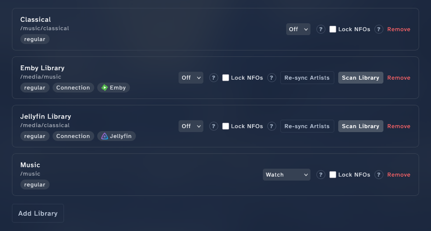
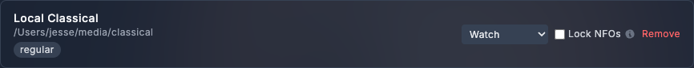

<!-- code: internal/scanner/scanner.go (Run, runScan, processDirectory, detectRemoved), internal/api/handlers_scan*.go (POST /api/v1/scans, GET /api/v1/scans/current), internal/watcher/watcher.go (filesystem watch + poll triggering scans), web/templates/settings.templ (per-library Scan Library / Re-sync Artists buttons in the Music Libraries section), internal/artist/duplicates.go (DetectDuplicates). -->

# Run scans

A **scan** is how Stillwater finds new artists, picks up changes, and removes vanished ones. There are three flavors:

- **Filesystem scan** -- walks library folders on disk.
- **Platform scan** -- pulls the artist list from a connected Emby, Jellyfin, or Lidarr instance.
- **Watch-triggered scan** -- happens automatically when filesystem watching is on.

This page covers triggering each one manually plus setting up recurrences.

## Run a manual filesystem scan

The trigger depends on whether the library is **manual** (you typed in the path) or **imported** (linked to an Emby/Jellyfin/Lidarr connection).

### Imported libraries

1. Open **Settings** and jump to the **Music libraries** section (left-side section nav, Essentials group).
2. Find the library you want to scan in the list.
3. Click **Scan Library** on its row.

The scan starts in the background. The library row shows a spinner; an event banner appears with progress. When it finishes, the row updates with new artist counts.

### Manual libraries

A manual library row has no per-row **Scan Library** button. The supported triggers for a manual library today are:

- **Filesystem watching.** Turn the row's **Filesystem monitoring mode** dropdown on (Watch, Poll, or Watch + Poll). Stillwater scans automatically when the watcher detects a new or removed artist directory -- see [Schedule recurring scans](#schedule-recurring-scans) below.
- **Per-artist bulk scan.** Open **Artists** in the sidebar, optionally filter to a subset, select the artists you want to (re)scan, then pick **Scan** in the bulk-action menu. This re-scans the selected artists' directories. The same menu also offers **Lock** and **Unlock** for changing the artist-lock state in bulk.

The scan is **structure-incremental** in both cases -- it walks every artist directory in the library, but it only does the expensive metadata-detect work on directories that don't already have an artist record. So a library with 4,000 artists where nothing has moved still gets walked, but the per-directory work collapses to "look up the existing artist by path" and finishes quickly. New or moved directories pay the full detect cost; existing ones are essentially free.

**Where to find the library controls:**

Settings is one long scrolling page. Down the left side is a section nav; click **Music libraries** in it (under the **Essentials** group) to jump straight to the **Music Libraries** section, or simply scroll to it. Every library is a row in that section.

### Scanning every library

There is no single "scan everything" button today. For imported libraries, click **Scan Library** on each row in turn. Stillwater runs at most one scan at a time globally, so a second click while one is in flight is rejected with a brief message; once the running scan finishes, click the next row.

For manual libraries the same constraints apply -- coverage comes from leaving the watcher on across all libraries and letting filesystem changes trigger the scans.

## Schedule recurring scans

For libraries on auto-pilot, recurring scans keep the catalog fresh without you clicking anything.

1. Open **Settings** and jump to the **Music libraries** section (left-side section nav, Essentials group).
2. On the library row, find the **Filesystem monitoring mode** dropdown (it sits next to the per-library actions).
3. Pick a mode:
   - **Off** -- no automatic scans. You trigger manually.
   - **Watch** -- the operating system tells Stillwater the moment a directory appears or disappears. Best on local filesystems.
   - **Poll** -- Stillwater snapshots the directory listing every few minutes and diffs. Required for many network mounts.
   - **Watch + Poll** -- watch fires fast, poll catches anything the watcher misses.
4. If you picked Poll or Watch + Poll, a second dropdown appears for the interval. Pick 1m, 5m, 15m, or 30m.

Stillwater probes each path on startup to decide whether watch mode is supported. The UI shows the result so you don't pick a mode that won't fire.

## Pull from a connected platform

When you've connected Emby, Jellyfin, or Lidarr, you can pull the platform's artist list instead of (or in addition to) walking the disk.

1. Open **Settings** and jump to the **Music libraries** section (left-side section nav, Essentials group) and find a library imported from a platform connection.
2. Click **Re-sync Artists** on its row.

Stillwater queries the platform's library and reconciles with what it has stored. New platform-side artists appear in Stillwater (pathless if they don't have a directory on disk yet); deleted ones are removed.

This is also how you bootstrap a Stillwater instance against an existing media server: connect, import the library, and let the platform scan populate the catalog.

## Monitor an in-progress scan

The current scan's status is visible in three places:

- **The library row** -- shows a spinner while running.
- **The site-wide event banner** -- progress and completion notifications appear here.
- **The scan history** under each library -- the last several scan results with started/completed timestamps and counts.

If a scan goes wrong, the banner surfaces an error and the library row reverts. The full error appears in the scan history detail.

## What scans do (and don't do)

A scan **discovers structure**: which directories exist, which `artist.nfo` files are present, what's missing. It populates Stillwater's database with what it finds.

A scan **does not**:

- Refresh metadata from providers. That's a separate action -- see [refresh metadata](refresh-metadata.md).
- Run rules. Rule evaluation is its own pass; you can enable a recurring rule run under **Settings > Rules**.
- Write NFO files. Stillwater writes NFOs only when you save changes or when a fixer runs.

So the typical workflow on a new library is: scan to discover artists -> refresh metadata to populate fields -> run rules to surface what still needs work.

## Concurrent-scan safety

Stillwater allows only one scan at a time across all libraries. A second click while any scan is running is rejected with a brief message; the running scan keeps going. The same constraint applies whether the scan was triggered manually, by the watcher, or by a recurring poll.

## When the watcher fires

When watch mode is on, Stillwater triggers a scan automatically:

- **A new subdirectory appears** in the library root -> the watcher debounces briefly (so a quick rename doesn't churn) and triggers a scan.
- **A subdirectory disappears** -> after the debounce, the corresponding artist is removed.
- **An artist directory's contents change** -> the watcher does *not* re-scan the artist's metadata; that requires a refresh. The watcher is structure-aware, not content-aware.

## Possible duplicate artists

During a filesystem scan, Stillwater compares each newly discovered artist's name against names already in the catalog. Names are normalized before comparison, so variations that differ only by punctuation style (curly vs. straight apostrophe), word separators (hyphen vs. underscore), or leading articles ("The Cure" vs. "Cure, The") are treated as the same name.

When a collision is detected, the scan log records a warning and the scan result count includes the number of suspected duplicates found.

To see which artist records were flagged, open the **Possible duplicate artists** report (direct URL: `/reports/duplicates`). The page groups artists that appear to be the same entity, with the higher-confidence **MBID match** groups (shared MusicBrainz ID) distinguished from **Name key match** groups (names normalize to the same value, but no MusicBrainz ID confirms it -- review these manually).

For how to review a group, pick a survivor, read the merge preview, and what happens on disk once you confirm, see [Merge duplicate artists](merge-duplicate-artists.md).
